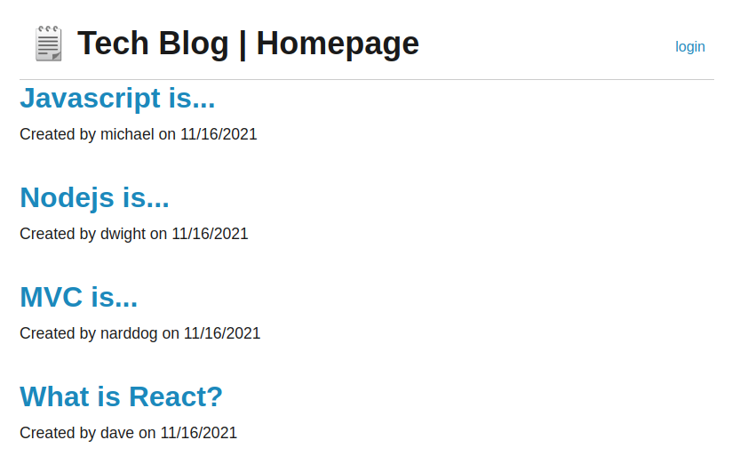
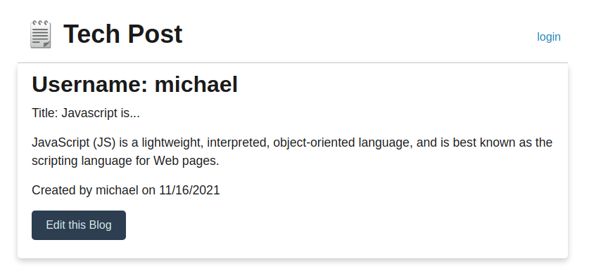

# Tech Blog

## Table of Contents

* [Description](#description)
* [Screenshot](#screenshot)
* [Installation](#installation)
* [Usage](#usage)
* [License](#license)
* [Questions](#question)

## Description

This app allows programmers to log in an make posts regard all things Tech (programming, software development, agile practivces, etc.). After a user makes a post, the post title will display on the homepage and people visiting the site can click on it and read the post.

## Screenshot
 

 

## Installation

No installation needed! It available on [Herok](https://tech-blog-dlm.herokuapp.com/)!

## Usage

People can visit the site and see posts without logging in. However, if you want to make a post you will need to log in to do so.

## License

MIT

## Questions
Contact me at:
* [GitHub](https://github.com/murda02)
* [Email](mailto:davelmurphy@zoho.com)